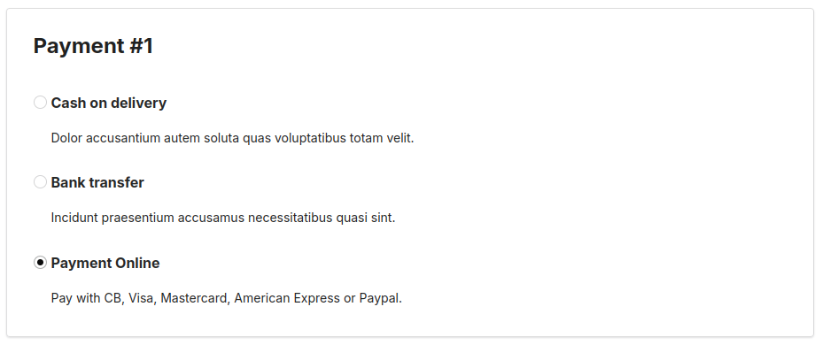

# [](https://www.monext.fr/)

# Monext Sylius Plugin

----

## Table of Content

* [Overview](#overview)
* [Features](#features)
* [Installation](#installation)
  * [Requirements](#requirements)
  * [Installation process](#installation-process)
* [Configuration](#configuration)
* [Additional resources for developers](#additional-resources-for-developers)
* [License](#license)
* [Contact and support](#contact-and-support)

## Overview

This plugin allows you to use the Monext payment system with a Sylius ecommerce application.


## Features

This plugin integrate with native Sylius orders' workflow and provides the following features:
It allows you to:
* Do offsite payment on a payment page hosted by Monext
* Choose between immediate capture or only triggered by a specific order state (like capture at shipping)
* Cancel payments (not partials)
* Refund payments (not partials)

This plugin does not use features from Sylius Plus.



## Installation

### Requirements

| Package                | Version      |
|------------------------|--------------|
| PHP                    | ^8.3         |
| ext-json:              | *            |
| sylius/resource-bundle | ^1.10        |
| sylius/sylius          | ^1.12.0      |
| symfony/messenger      | ^5.4 or ^6.4 |

### Installation process

Simply add the plugin to your project:

```bash
composer require monext/payline-sylius
```

Add plugin dependencies to your `config/bundles.php` file by adding this line to the end of the array (if it does not already exist) :

```php
    MonextSyliusPlugin\MonextSyliusPlugin::class => ['all' => true]
```

Then add this line to your `config/routes.yaml`:
```yaml
monext_sylius_plugin:
    resource: "@MonextSyliusPlugin/Resources/config/routing.yaml"
```

Finally, in `config/packages/_sylius.yaml` add this to the `imports` section:
```yaml
    - { resource: "@MonextSyliusPlugin/Resources/config/config.yaml" }
```

Clear cache and run migrations:
```bash
bin/console cache:clear
bin/console doctrine:migration:migrate
```

## Configuration

Once the plugin is installed you'll be able to create add a new payment method of type "Monext" in you Sylius admin and configure it.

Here is the list of the main configuration fields:
* API KEY:
  * Base64-encoded credentials
* Point of sale
  * Recommended to use one per Sylius channel, it's Monext's point of sale linked to the payments processed by this method
* Environment
  * Homologation for debug and test purpose
  * Production for real payment
* Contract numbers
  * Payment contract numbers enabled should be used
  * **Note:** If you prefer, you can leave this field empty, and it will use all contract enabled in the Monext admin
* Capture type
  * Automatic: Authorization + Capture are immediately done
  * Manual: Only Authorization is immediate, Capture should be either done manually or will be triggered by a specific transition in shipping states
* Transition for manual capture
  * Comma-separated list of *transitions* in the Winzou state manager used for triggering a manual capture

---


## Additional resources for developers

To learn more about how the API used by the plugin and how to modify or use Sylius with it to fit your needs:
* [Monext API documentation](https://api-docs.retail.monext.com/reference/getting-started-with-your-api)
* [Sylius Documentation](https://docs.sylius.com/en/latest/)
* [Sylius Online Course](https://sylius.com/online-course/)

## License

This plugin's source code is completely free and released under the terms of the MIT license.

## Contact and support

If you want to contact us, the best way is through [this page on our website](https://www.monext.fr/gardons-le-contact) and send us your question(s).

We guarantee that we answer as soon as we can!

If you need support you can also directly check our FAQ section and contact us [on the support page](https://support.payline.com/hc/fr).
